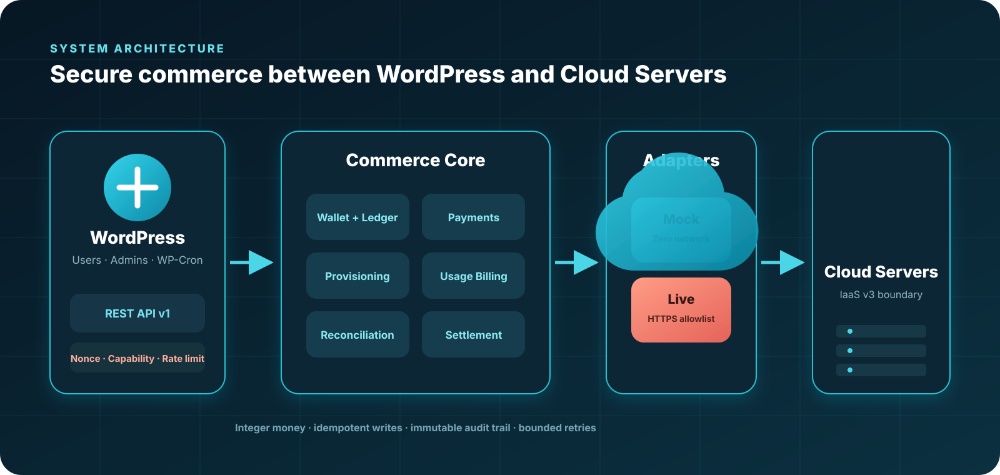
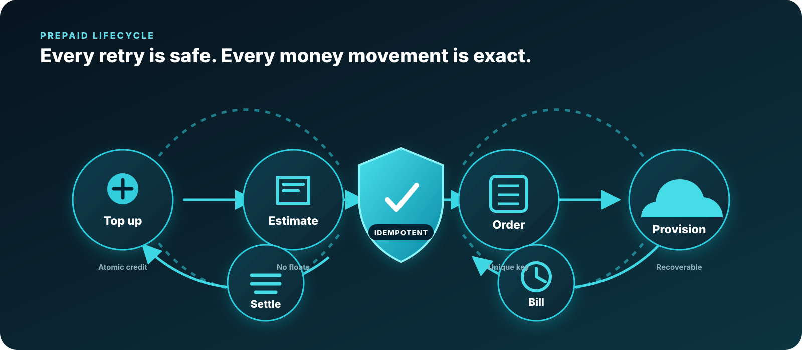

<div align="center">

# ArvanCloud Commerce Plugin

### A secure, prepaid Cloud Server reseller backend for WordPress.

[](arvan-reseller/arvan-reseller.php)
[](https://www.php.net/)
[](https://wordpress.org/)
[](arvan-reseller/readme.txt)


**[Backend contract](docs/backend.md) · [REST API](#rest-api-at-a-glance) · [Security model](#security-by-design) · [Testing](#quality-and-testing)**

</div>

> [!IMPORTANT]
> **Mock Mode is the safe default and never makes an HTTP request.** Live Mode only uses published ArvanCloud IaaS v3 operations. The current public specification exposes neither per-server usage nor reseller payout endpoints, so usage is derived from the snapshotted hourly flavor price and settlements remain internal accounting records.

## What this project does

ArvanCloud Commerce turns WordPress into a guarded backend for prepaid Cloud Server resale. Customers fund an integer-money wallet, estimate a configuration, place an idempotent order, and consume balance through exact UTC billing windows. Administrators get safe settings, reconciliation, settlement summaries, audit trails, and job health—without exposing keys or trusting customer-supplied ownership.



## Commerce lifecycle



| Stage | Guarantee |
| --- | --- |
| **Top up** | Mock payment intents confirm atomically and credit the wallet once. |
| **Estimate** | Decimal-string hours and catalog flavor prices avoid float drift. |
| **Order** | A unique idempotency key prevents duplicate server creation. |
| **Provision** | Local pending state exists before the remote call; reconciliation repairs partial success. |
| **Bill** | Immutable UTC usage windows debit an integer-money ledger exactly once. |
| **Protect** | Low-balance alerts, zero-balance suspension, and configurable termination are retry-safe. |
| **Settle** | Daily internal settlement references are deterministic and idempotent. |

## Feature highlights

- Integer money at scale **10,000**; floats are rejected
- Atomic wallet balance + immutable ledger mutation in one InnoDB transaction
- Deterministic, zero-network Mock Cloud adapter
- Allowlisted Live adapter for documented IaaS v3 operations
- Mock payments, refunds, catalog estimates, Cloud Server orders, and owned resources
- Hourly prepaid billing with unique resource/window and billing-reference constraints
- Low-balance notification deduplication and zero-balance resource policies
- Provisioning recovery markers and safe reconciliation
- Versioned, authenticated API-key encryption with explicit rotation and deletion
- Capability checks, WordPress REST nonces, rate limits, redacted audit events, and anti-IDOR responses
- Versioned schema migrations, bounded retry state, Cron health, and keyset pagination
- Customer and administrator REST surfaces under one versioned namespace

## Mock versus Live

| Capability | Mock Mode | Live Mode |
| --- | --- | --- |
| Network access | **Always blocked** | HTTPS to a validated `.arvanapis.ir` host only |
| Catalogs and provisioning | Deterministic fixtures | Published IaaS v3 operations |
| Usage source | Snapshotted Mock flavor price | Snapshotted published flavor hourly price |
| Settlement | Internal accounting | Internal accounting; no external payout claimed |
| API key | Not required | Encrypted least-privilege Machine User key |
| Best for | Development, CI, demos | Controlled production integration |

## Quick start

### Requirements

- WordPress 6.4+
- PHP 8.2+
- MySQL/MariaDB with InnoDB
- Composer 2 for development checks

### Install the plugin

1. Copy `arvan-reseller/` into `wp-content/plugins/arvan-reseller/`.
2. Activate **Arvan Reseller** from the WordPress Plugins screen.
3. Open **Arvan Reseller → Settings**.
4. Keep API Mode set to `mock` for development and demos.
5. Grant `manage_arvan_reseller` only to trusted administrators.

For production, run a monitored system scheduler against `wp-cron.php` at least every five minutes. Disable visitor-triggered WP-Cron only after the replacement is verified.

### Install development dependencies

```bash
composer install
composer test
```

## REST API at a glance

Base namespace: `/wp-json/arvan-reseller/v1`

State-changing requests require an authenticated WordPress cookie, `X-WP-Nonce`, and—where documented—a unique `Idempotency-Key`.

### Customer routes

| Area | Routes |
| --- | --- |
| Wallet | `GET /wallet`, `GET /wallet/transactions` |
| Payments | `GET/POST /payments`, `POST /payments/{reference}/confirm` |
| Catalog | `GET /catalog/regions`, `/images`, `/flavors`; `POST /catalog/estimate` |
| Orders | `GET/POST /orders` |
| Resources | `GET /resources`, `GET /resources/{local-id}` |
| Records | `GET /usage`, `GET /invoices`, `GET /notifications` |

### Administrator routes

| Area | Routes |
| --- | --- |
| Configuration | `GET/PUT/PATCH /admin/settings`, `POST /admin/connection-test` |
| Operations | `POST /admin/cron/run`, `POST /admin/reconciliation/run`, `GET /admin/health` |
| Commerce | `GET /admin/customers`, `/wallets`, `/payments`, `/orders`, `/resources`, `/usage` |
| Finance & audit | `POST /admin/payments/{reference}/refund`, `GET /admin/settlements`, `GET /admin/audit-logs` |

The exact request/response contract, error codes, redaction rules, and supported parameters live in [`docs/backend.md`](docs/backend.md).

## Security by design

```text
Customer identity  <- authenticated WordPress user
Write authority    <- cookie + REST nonce
Admin authority    <- manage_arvan_reseller capability + rate limit
Secrets            <- authenticated encryption; never returned
Live destination   <- validated region + fixed HTTPS allowlist
Financial mutation <- transaction lock + immutable ledger + idempotency
```

- Customer IDs are derived server-side and are never accepted from customer requests.
- Foreign and missing resources intentionally share the same 404 shape to reduce ID enumeration.
- Redirects and custom API hosts are not permitted in Live Mode.
- Raw remote payloads, SQL errors, stack traces, paths, and encrypted material never appear in safe REST responses.
- Blank API-key updates preserve the current secret; deletion requires an explicit action.
- Deactivation retains financial data. Uninstall also retains it unless irreversible deletion was explicitly enabled.

## Quality and testing

| Command | Coverage |
| --- | --- |
| `composer lint` | PHP syntax across plugin and tests |
| `composer phpcs` | WordPress coding standards |
| `composer phpstan` | Static analysis |
| `composer phpunit` | Backend behaviour and security tests |
| `composer test` | Syntax + PHPUnit suite |
| `php tests/run.php` | Standalone domain and invariant harness |
| `php tests/activation.php` | Clean activation and migration harness |

The disposable Docker scenario in `tests/docker-compose.yml` installs WordPress, activates the plugin, blocks application HTTP, tops up a wallet, provisions a Mock server, bills usage, applies balance policy, reconciles state, and completes settlement. The REST smoke scenario also verifies nonce checks, capability enforcement, redaction, and customer isolation.

> [!WARNING]
> Automated scenarios must use Mock Mode. A real key is never required, and test runs must never invoke paid provisioning.

## Repository map

```text
.
├── arvan-reseller/
│   ├── admin/                  # Menu, settings controller, admin view
│   ├── database/               # Schema and versioned migrations
│   ├── includes/               # Wallet, billing, provisioning, adapters, REST
│   ├── frontend/               # Reserved frontend extension points
│   ├── arvan-reseller.php      # Plugin bootstrap
│   └── uninstall.php           # Data-retention-aware uninstall
├── docs/
│   └── backend.md              # Canonical backend and operations contract
├── tests/
│   ├── phpunit/                # Focused automated tests
│   ├── docker-compose.yml      # Disposable WordPress + MariaDB
│   ├── wordpress-e2e.php       # Full no-network Mock lifecycle
│   └── wordpress-rest.php      # Real REST registration/security smoke test
├── composer.json               # Quality commands and dev dependencies
└── phpunit.xml.dist            # PHPUnit configuration
```

## Live API boundary

The Live adapter is intentionally narrow:

```text
GET  /availability-zones
GET  /images
GET  /flavors
POST /servers
GET  /servers/{id}
POST /servers/{id}/power-off
POST /servers/{id}/terminate
```

Anything outside that published surface is not invented or implied. See the [backend contract](docs/backend.md) for operational details and known API limitations.

---

<div align="center">

**Deterministic in Mock Mode. Defensive in Live Mode. Exact around money.**

</div>
