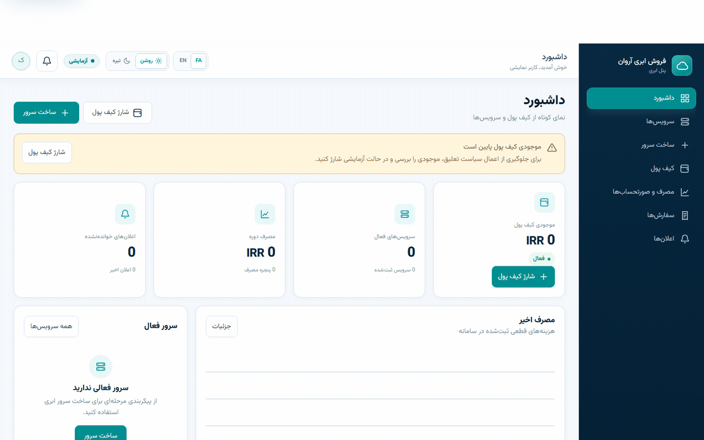
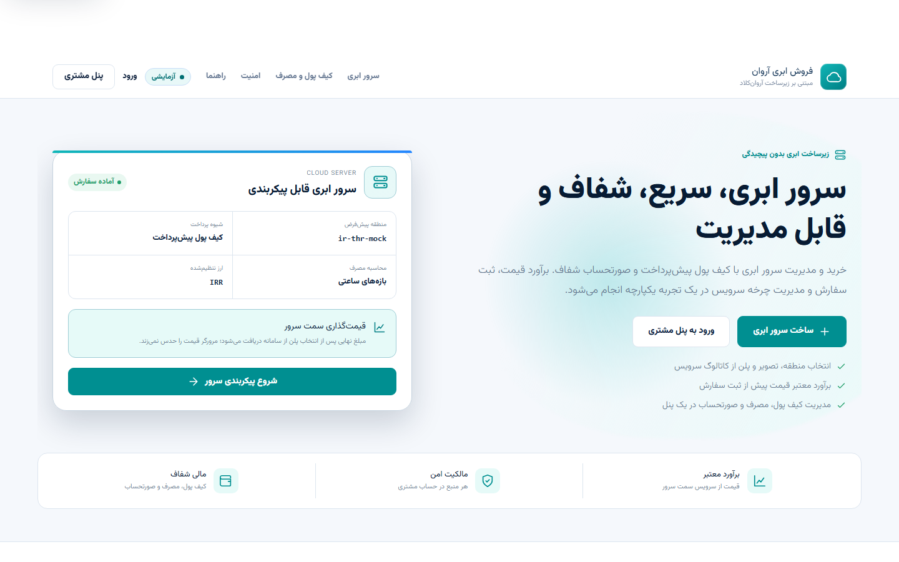
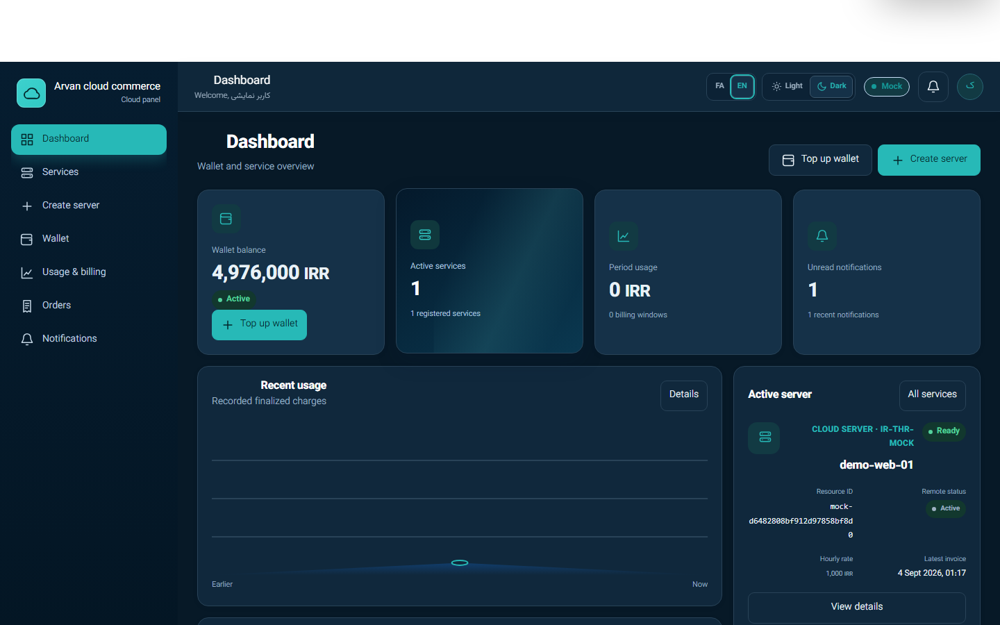
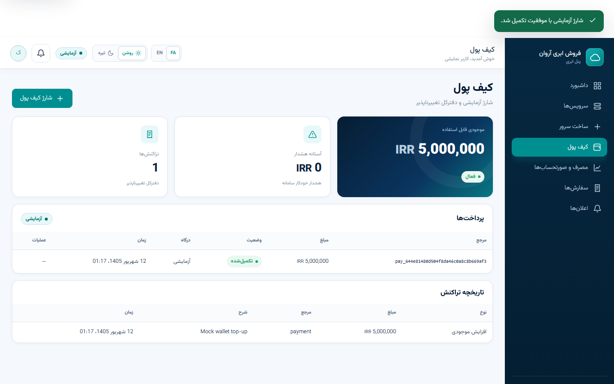
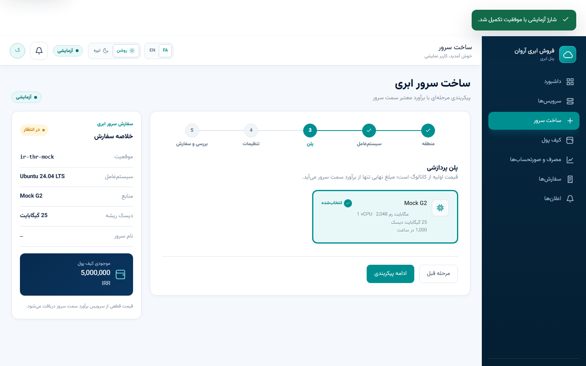
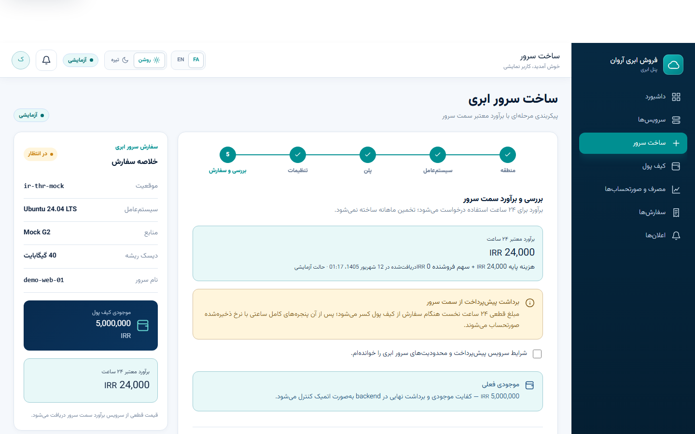
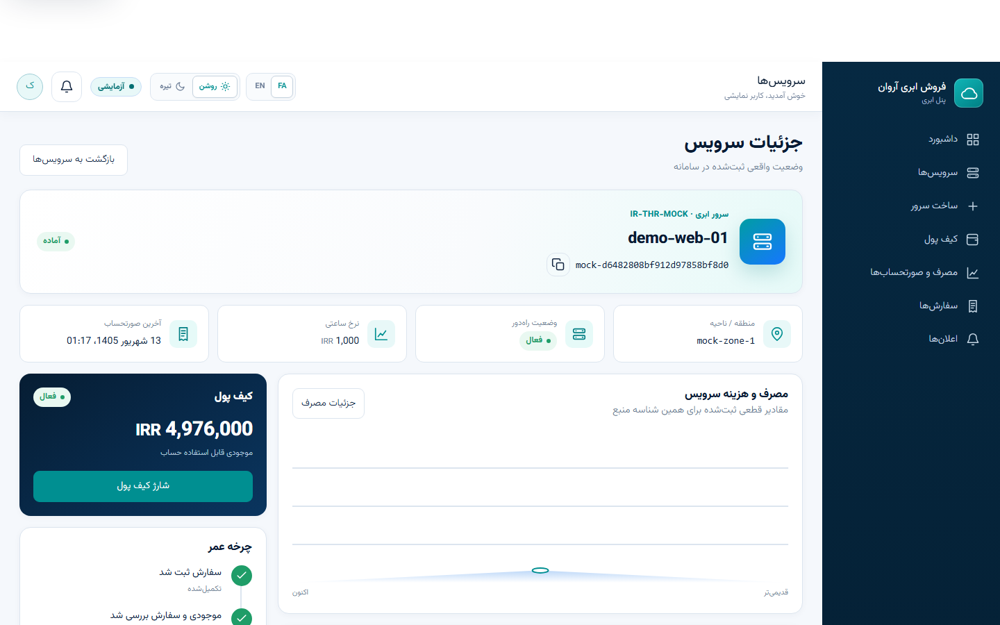
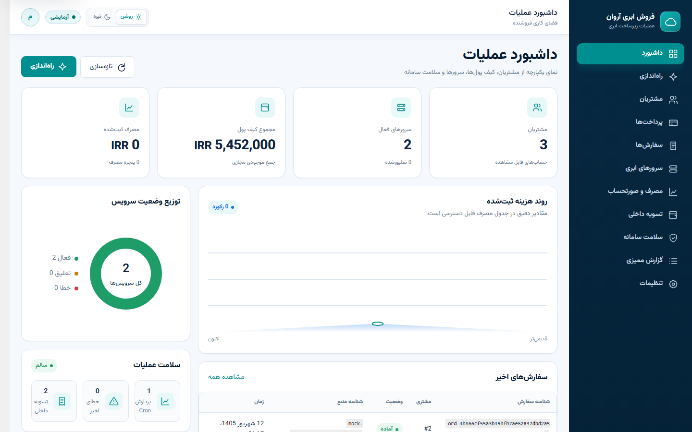
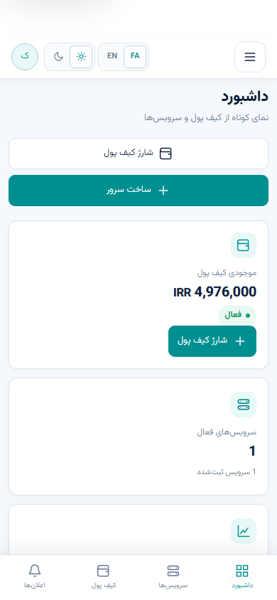

<div align="center">

# ArvanCloud Commerce Plugin

**A secure, prepaid Cloud Server reseller storefront and customer portal for WordPress.**

[](arvan-reseller/arvan-reseller.php)
[](https://wordpress.org/)
[](https://www.php.net/)
[](https://github.com/Fatima-Setayesh/arvancloud-commerce-plugin/actions/workflows/ci.yml)
[](#product-tour)
[](arvan-reseller/readme.txt)


<sub>Presentation artwork — the real LocalWP product appears in the demo below.</sub>

**[Demo](#demo) · [Product Tour](#product-tour) · [Capabilities](#core-capabilities) · [Architecture](#architecture) · [Security](#security-by-design) · [Testing](#quality-and-testing) · [Installation](#installation)**

</div>

## Demo

**End-to-end Mock Mode:** wallet top-up → configuration → authoritative estimate →
order → provisioning → active resource.

The 34.5-second, 1280×800, 12fps loop below was captured from the real LocalWP
runtime. It also closes with the existing dark-mode card and button interactions in
Persian and English. It does **not** claim or depict paid Live provisioning.



> [!IMPORTANT]
> Mock Mode is complete, heavily tested, and the safe default. The narrow Live
> adapter is implemented and code-reviewed, but a real ArvanCloud Machine User
> connection has not been verified by an authorized human. This is not presented
> as an official ArvanCloud product or certified partnership.

ArvanCloud Commerce is a standalone WordPress plugin built around ArvanCloud Cloud
Server reseller APIs. It combines a theme-independent public storefront, bilingual
customer portal, prepaid wallet, immutable ledger, provisioning, hourly billing,
invoices, notifications, and reseller operations.

It relies on WordPress core APIs, authentication, roles, REST, Cron, and custom
database tables. It does **not** require WooCommerce, Elementor, ACF, a page builder,
a third-party commerce plugin, or a particular WordPress theme.

| Product area | Current status |
| --- | --- |
| Customer and reseller portals | **Complete** |
| Wallet, ledger, billing, invoices, notifications | **Complete** |
| Catalog, estimate, orders, provisioning | **Complete in Mock Mode** |
| Payments | **Mock only** |
| Settlement | **Internal accounting only** |
| Live ArvanCloud adapter | **Implemented · Live unverified** |
| Commercial product scope | **Cloud Server only** |

See [PROJECT_STATUS.md](PROJECT_STATUS.md) for the detailed implementation and
verification matrix.

## Product Tour

Eight primary captures represent the real product without turning the README into a
vertical screenshot dump. The customer UI supports Persian and English, light and
dark themes, responsive navigation, and reduced-motion preferences.

<table>
  <tr>
    <td width="50%"></td>
    <td width="50%"></td>
  </tr>
  <tr>
    <td align="center"><strong>Public storefront</strong></td>
    <td align="center"><strong>Customer dashboard · dark · English</strong></td>
  </tr>
  <tr>
    <td></td>
    <td></td>
  </tr>
  <tr>
    <td align="center"><strong>Wallet and Mock top-up</strong></td>
    <td align="center"><strong>Server configurator</strong></td>
  </tr>
  <tr>
    <td></td>
    <td></td>
  </tr>
  <tr>
    <td align="center"><strong>Estimate and order review</strong></td>
    <td align="center"><strong>Active resource details</strong></td>
  </tr>
  <tr>
    <td></td>
    <td></td>
  </tr>
  <tr>
    <td align="center"><strong>Reseller operations</strong></td>
    <td align="center"><strong>Mobile experience</strong></td>
  </tr>
</table>

The complete capture set, including the Persian/English dark interaction states and
mobile navigation drawer, is available in [docs/screenshots/](docs/screenshots/).

## What this project does

Customers can:

- register, sign in, and use a protected WordPress-backed customer session;
- top up a virtual prepaid wallet in Mock Mode and review immutable transactions;
- configure a Cloud Server and receive a backend-authoritative estimate;
- place an idempotent order and follow provisioning to a mapped Resource ID;
- view services, usage, billing windows, invoices, orders, and notifications.

Resellers and trusted administrators can:

- configure identity, Cloud Server access, pricing share, and lifecycle policies;
- inspect customers, wallets, payments/refunds, orders, and mapped resources;
- review usage, invoices, internal settlement, reconciliation, job health, and audit
  history;
- rotate or delete an encrypted Machine User credential without exposing it through
  the settings API.

## Core capabilities

| Foundation | Reliability and operations |
| --- | --- |
| Integer money at scale `10,000`; floats rejected | Idempotent payments, orders, billing, invoices, and settlement |
| Atomic wallet balance and immutable ledger mutation | Local pending state before remote provisioning |
| Backend-authoritative estimates and first-24-hour prepayment | Recovery markers, reconciliation, bounded retries, and Cron health |
| Snapshotted hourly price and exact UTC billing windows | Low-balance notices, suspension, and termination policies |
| Deterministic zero-network Mock adapter | Allowlisted HTTPS Live adapter for documented IaaS operations |
| Stable Resource ID mapping and customer ownership | Schema migrations, pagination, health checks, and redacted audit events |
| Reseller-share and per-currency internal settlement | Encrypted secret lifecycle, anti-IDOR responses, nonce/capability protection |

## Architecture


Authenticated WordPress REST requests pass through nonce, capability, ownership, and
rate-limit controls into the commerce services. Mock provisioning is deterministic
and performs zero external provisioning HTTP. Live requests are restricted to a
validated regional HTTPS ArvanCloud IaaS v3 destination.

## Commerce Lifecycle


| Stage | Current guarantee |
| --- | --- |
| **Top up** | Mock payment confirmation is atomic, idempotent, and credits once. |
| **Estimate** | Decimal-string hours, integer money, and catalog pricing avoid floating-point drift. |
| **Order** | The backend prices and debits the first 24 hours before remote create; a unique key prevents duplicates. |
| **Provision** | Local pending state exists first; recovery and reconciliation cover partial or ambiguous outcomes. |
| **Bill** | Immutable UTC usage windows and unique ledger references prevent duplicate charging after `prepaid_until`. |
| **Protect** | Low-balance notices, suspension, and configured termination are retry-safe. |
| **Settle** | Per-currency internal settlement references are deterministic and idempotent; no payout is implied. |

## Mock Mode versus Live Mode

| Capability | Mock Mode | Live Mode |
| --- | --- | --- |
| External provisioning HTTP | **Zero** | Validated HTTPS `.arvanapis.ir` destination only |
| Catalog and estimate | Complete deterministic fixtures | Adapter implemented; real connection unverified |
| Orders and provisioning | Complete and browser-tested | Implemented; paid provisioning not tested |
| Resource mapping | Complete | Implemented; human integration verification pending |
| Billing and invoices | Complete from snapshotted hourly pricing and UTC windows | Same local model; no official per-server usage endpoint |
| Payments | Mock create/confirm/refund | External payment gateway not implemented |
| Notifications | Complete | Local notification lifecycle implemented |
| Settlement | Internal accounting only | Internal accounting only; no external payout |
| Machine User key | Not required | Authenticated-encrypted least-privilege key |

## Security by design

```text
Customer identity  <- authenticated WordPress user resolved server-side
Write authority    <- authenticated cookie/session + REST nonce
Admin authority    <- manage_arvan_reseller capability + protected endpoints
Secrets            <- authenticated encryption; never returned through settings REST
Live destination   <- validated region + fixed HTTPS ArvanCloud host rules
Financial mutation <- transaction/locking + immutable ledger + idempotency
```

- Customer IDs are not accepted from customer requests; customer A cannot retrieve
  customer B resources.
- Cross-customer authenticated REST isolation tests pass, and foreign/missing
  resources share the same safe 404 shape to limit ownership leakage.
- Raw remote payloads, SQL errors, stack traces, filesystem paths, and encrypted
  material are excluded from safe responses and redacted from audit data.
- Unsafe redirects and arbitrary Live API hosts are rejected.
- Corrupt or unsupported credential encryption fails closed; rotation and deletion
  require explicit actions.
- Deactivation retains data. Uninstall removes the encrypted API credential and
  transient security state; domain tables follow the configured deletion policy.

## REST API at a glance

Base namespace: `/wp-json/arvan-reseller/v1`

State-changing calls use the authenticated WordPress cookie/session and
`X-WP-Nonce`; payment and order creation also use a unique `Idempotency-Key`.
Customer identity is always derived server-side.

### Customer routes

| Area | Current routes |
| --- | --- |
| Wallet | `GET /wallet`, `GET /wallet/transactions` |
| Payments | `GET/POST /payments`, `POST /payments/{reference}/confirm` |
| Catalog | `GET /catalog/regions`, `/images`, `/flavors`; `POST /catalog/estimate` |
| Orders | `GET/POST /orders` |
| Resources | `GET /resources`, `GET /resources/{local-id}` |
| Records | `GET /usage`, `GET /invoices`, `GET /notifications`; `POST /notifications/{id}/read` |

### Administrator routes

| Area | Current routes |
| --- | --- |
| Configuration | `GET/PUT/PATCH /admin/settings`, `POST /admin/connection-test` |
| Operations | `POST /admin/cron/run`, `POST /admin/reconciliation/run`, `GET /admin/health` |
| Commerce | `GET /admin/customers`, `/wallets`, `/payments`, `/orders`, `/resources`, `/usage` |
| Finance and audit | `POST /admin/payments/{reference}/refund`, `GET /admin/settlements`, `GET /admin/audit-logs` |

The exact request/response contract, parameters, error codes, pagination, redaction,
and ownership rules live in the [backend contract](docs/backend.md).

## Quality and testing

Latest verified results on the approved product baseline:

| Check | Result |
| --- | --- |
| Standalone domain suite | **29 passed · 0 failed** |
| Activation and migration harness | **PASS** |
| Mock end-to-end lifecycle | **PASS** |
| Disposable real WordPress E2E | **PASS** |
| Clean installation | **PASS** |
| Cross-customer authenticated isolation | **PASS** |
| PHPUnit | **11 tests · 51 assertions · PASS** |
| PHPStan | **0 errors** |
| PHP syntax | **43/43 · PASS** |
| JavaScript syntax | **4/4 · PASS** |
| Authenticated encryption / crypto | **PASS** |
| Secret and debug scan | **PASS** |
| Browser Mock provisioning and retry stability | **PASS** |

PHPCS is intentionally **not** represented as green. The current baseline reports
approximately **2,252 errors and 217 warnings across 34 files**, primarily existing
WordPress coding-standard, formatting, whitespace, naming, alignment, and CRLF debt.
Reviewed samples exposed no known release-critical correctness or security defect.
Repository-wide PHPCBF was intentionally deferred to avoid a large, risky cosmetic
pre-release diff.

## Installation

### Requirements

- WordPress 6.4 or newer
- PHP 8.2 or newer
- MySQL or MariaDB with InnoDB
- Composer 2 only for development checks

### Install and activate

1. Install the `arvan-reseller/` plugin directory or its release package under
   `wp-content/plugins/`.
2. Activate **Arvan Reseller** in WordPress.
3. Open **Arvan Reseller → Setup/Settings** and keep API Mode on **Mock** for
   development and demonstrations.
4. Review the activation-created Storefront and Customer Portal pages.
5. Grant `manage_arvan_reseller` only to trusted administrators.

Activation performs versioned custom-table migrations, assigns the administrator
capability, creates/checks the generated pages idempotently, and schedules billing
and reconciliation jobs. The pages use `[arvan_reseller_store]` and
`[arvan_reseller_portal]`.

Normal WP-Cron is traffic-dependent. For reliable production billing, use a monitored
system scheduler to invoke `wp-cron.php` regularly; do not disable visitor-triggered
Cron until its replacement is verified.

### Development checks

```bash
composer install
composer lint
composer phpunit
composer phpstan
composer phpcs

php tests/run.php
php tests/activation.php
php tests/e2e.php
```

No npm package or JavaScript framework is required at runtime. The customer
experience uses PHP templates, scoped CSS, modular vanilla JavaScript, and the
WordPress REST API.

## Repository map

```text
.
├── arvan-reseller/
│   ├── admin/                  # Reseller operations
│   ├── assets/                 # Shared design system and JavaScript
│   ├── database/               # Schema and versioned migrations
│   ├── frontend/               # Storefront, authentication, customer portal
│   ├── includes/               # Commerce, security, REST, cloud adapters
│   ├── arvan-reseller.php      # Plugin bootstrap
│   └── uninstall.php           # Data-retention-aware uninstall
├── docs/
│   ├── assets/                 # Hero, architecture, lifecycle artwork
│   ├── demo/                   # Real Mock-mode GIF
│   └── screenshots/            # Real LocalWP product captures
├── tests/                      # Unit, invariant, activation, and E2E harnesses
├── composer.json               # Development quality commands
├── phpunit.xml.dist
├── phpstan.neon.dist
└── phpcs.xml.dist
```

Further documentation:
[backend contract](docs/backend.md) ·
[setup guide](docs/setup-guide.md) ·
[UI system](docs/ui-system.md) ·
[frontend architecture](docs/frontend-architecture.md) ·
[Live API checklist](docs/live-api-checklist.md) ·
[project status](PROJECT_STATUS.md)

## Live API boundary

The Live adapter is intentionally narrow and currently implements only these
documented ArvanCloud IaaS v3 concepts:

```text
GET  /availability-zones
GET  /images
GET  /flavors
POST /servers
GET  /servers/{id}
POST /servers/{id}/power-off
POST /servers/{id}/terminate
```

Anything outside this allowlisted surface is neither invented nor implied. The
adapter is implemented and code-reviewed; an authorized, read-only human connection
test with a real least-privilege Machine User credential remains outstanding. Follow
the [Live API checklist](docs/live-api-checklist.md) before any potentially billable
operation.

## Limitations and release status

- Live authentication with a real Machine User and paid Live provisioning remain
  unverified.
- No external payment gateway is integrated; customer payments are Mock only.
- Settlement is internal accounting and does not initiate an external payout.
- Cloud Server is the only supported commercial product; CDN, Object Storage, DNS,
  Kubernetes, and other ArvanCloud products are outside the purchase flow.
- Powering off a server cannot guarantee that the external provider stops billing.
- Ambiguous Live create failures require human resolution instead of unsafe automatic
  retry or refund.
- Billing uses snapshotted hourly flavor pricing and exact UTC windows, not an
  official per-server usage endpoint.
- Visitor-triggered WP-Cron is not a guaranteed scheduler.
- PHPCS style debt remains documented and non-release-critical.

---

<div align="center">

Built around ArvanCloud Cloud Server reseller APIs.

**Deterministic in Mock Mode. Defensive in Live Mode. Exact around money.**

</div>
