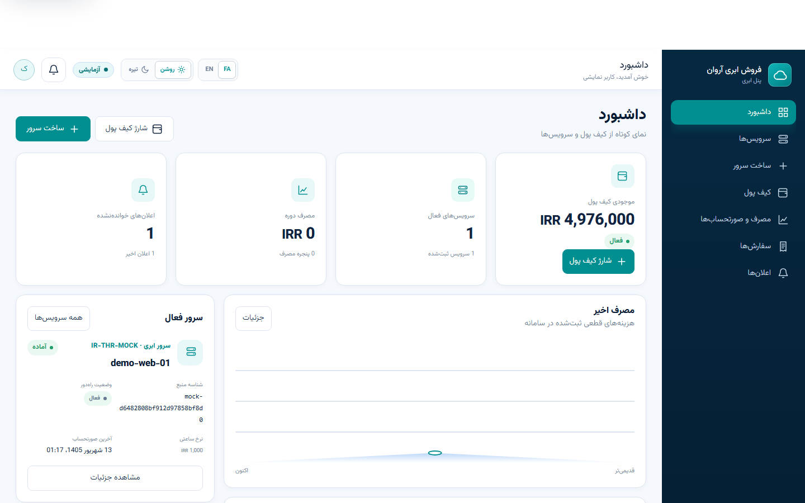
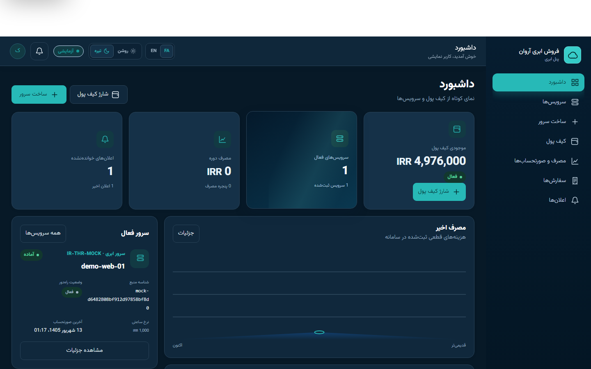
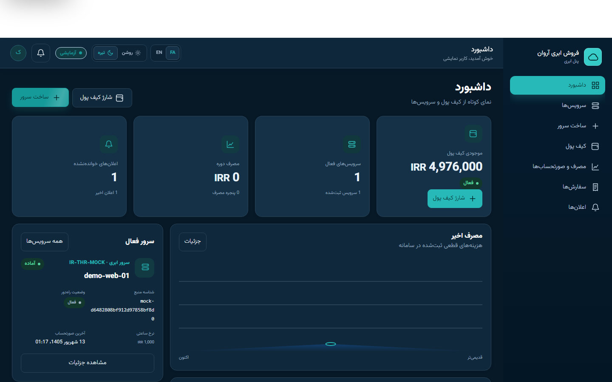
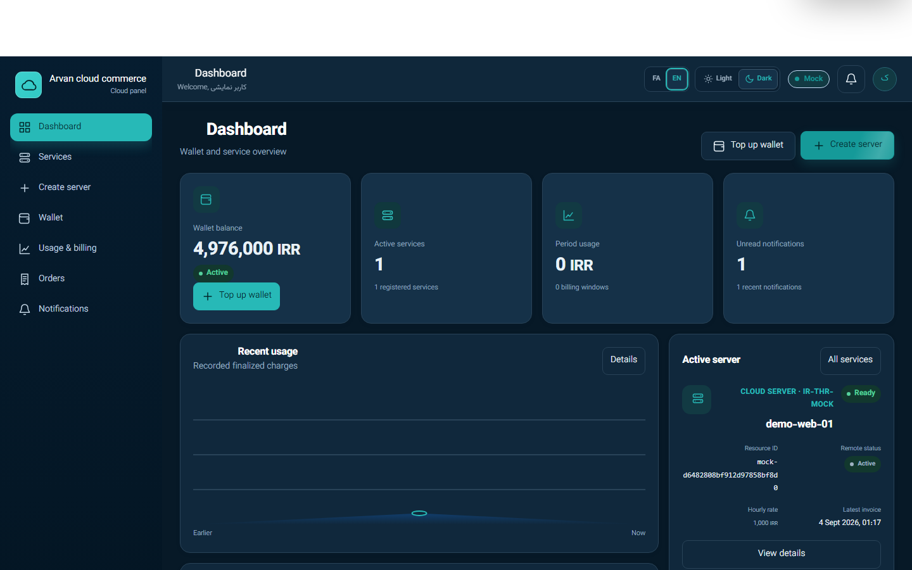
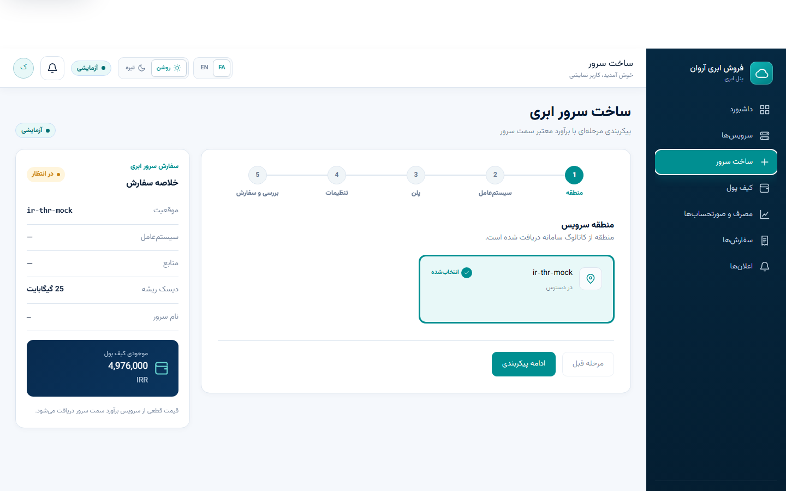
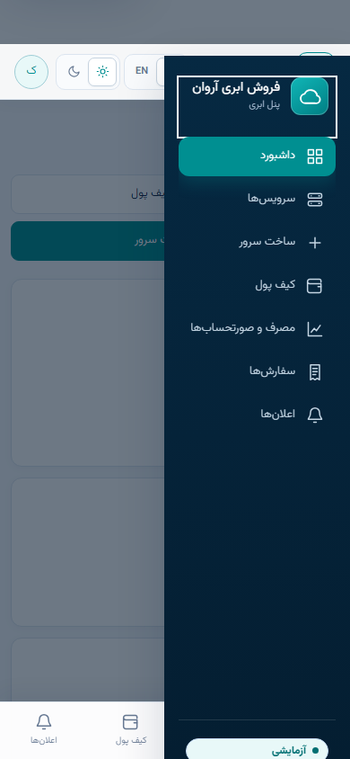
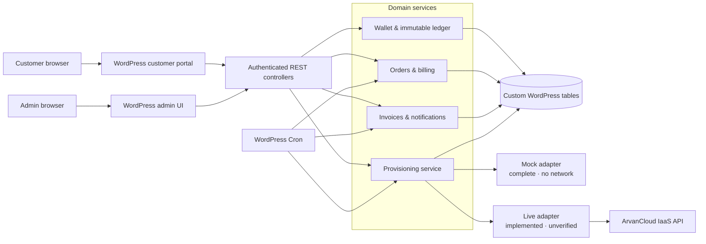
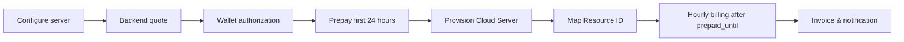

<div align="center">

# ArvanCloud Commerce Plugin

**WordPress Cloud Server reseller storefront, customer portal, and billing system.**

[](https://wordpress.org/)
[](https://www.php.net/)
[](#product-scope)
[](#verified-quality)
[](#verified-quality)
[](#customer-experience)


</div>

ArvanCloud Commerce is a standalone WordPress plugin for selling and managing
**ArvanCloud Cloud Server** services through a reseller storefront. It combines a
theme-independent public storefront, bilingual customer portal, prepaid wallet,
immutable ledger, server provisioning, hourly billing, invoices, notifications,
and reseller operations in one plugin.

It uses WordPress core APIs, sessions, roles, REST authentication, Cron, and custom
database tables. It does **not** require WooCommerce, Elementor, ACF, a page builder,
a third-party commerce plugin, or a specific WordPress theme.

> [!IMPORTANT]
> Mock Mode is complete and is the safe default. The Live adapter is implemented
> and code-verified, but a real ArvanCloud Machine User connection has not yet been
> human-verified. This repository is not presented as an official ArvanCloud product
> or certified partnership.

## Demo

The following 34.5-second loop is captured from the real LocalWP runtime in Mock
Mode: dashboard → wallet top-up → server configuration → backend estimate → order
and provisioning → resource details → dark-mode card and button interactions in
Persian and English.


## Product status

| Area | Status | Current scope |
| --- | --- | --- |
| Customer and admin portals | **COMPLETE** | Responsive customer experience, reseller operations, FA/EN customer UI |
| Wallet, ledger, billing, invoices | **COMPLETE** | Integer money, immutable ledger, first 24h prepaid, then hourly billing |
| Payments | **MOCK ONLY** | Atomic, idempotent Mock create/confirm/refund; no external gateway |
| Catalog, estimate, orders, provisioning | **COMPLETE IN MOCK** | Deterministic no-network Cloud Server flow |
| Resource mapping and lifecycle | **COMPLETE** | Owned Resource ID mapping, recovery, suspension, termination |
| Settlement | **INTERNAL ONLY** | Internal per-currency accounting; no external payout integration |
| Live ArvanCloud adapter | **LIVE UNVERIFIED** | Allowlisted IaaS v3 operations; real credential check still required |
| Supported commercial products | **CLOUD SERVER ONLY** | CDN and Object Storage purchase flows are not implemented |

See [PROJECT_STATUS.md](PROJECT_STATUS.md) for the detailed implementation and
verification record.

## Capabilities

### Customer experience

- Public Persian Cloud Server storefront with clear Mock/Live environment state
- WordPress-native registration, login, password reset, and protected sessions
- Persian/English customer portal with light/dark themes
- Wallet balance, top-up, transaction history, and low-balance warnings
- Five-step region, operating-system, plan, options, and review configurator
- Backend-authoritative estimate and wallet sufficiency check
- Orders, provisioning tracker, services, Resource IDs, usage, and invoices
- Notifications, empty/loading/error states, mobile drawer, and bottom navigation

### Commerce and Cloud Server operations

- Virtual prepaid wallet with integer money at scale `10,000`
- Transactional cached balance and immutable ledger mutation
- Idempotent payment, order, provisioning, billing, and settlement paths
- Authoritative first-24-hour prepayment before remote provisioning
- Hourly billing windows after `prepaid_until`, with uncovered-amount tracking
- Deterministic Mock catalog and provisioning adapter with zero application HTTP
- Live adapter for allowlisted catalog, create, status, power-off, and terminate calls
- Local Resource ID mapping, ambiguous-outcome hold, and reconciliation paths

### Reseller operations

- Guided setup and protected configuration
- Customers, wallets, payments/refunds, orders, and Cloud Server resources
- Usage, invoices, internal settlement, health, reconciliation, and audit views
- Reseller share, wallet thresholds, suspension, termination, and Cron policies
- Encrypted Machine User credential lifecycle with explicit rotation and deletion

## Product tour

### Customer portal

<table>
  <tr>
    <td width="50%"></td>
    <td width="50%"></td>
  </tr>
  <tr>
    <td align="center"><strong>Dashboard · dark mode</strong></td>
    <td align="center"><strong>Wallet · Mock top-up</strong></td>
  </tr>
</table>

### Dark interaction states · فارسی / English

These frames show the existing restrained lift, highlight, and sweep motion used
by dashboard cards and primary actions. The same interactions appear at the end
of the demo loop; no Uiverse dimensions, colors, typography, or excessive glow
effects were copied into the product UI.

<table>
  <tr>
    <td width="50%"></td>
    <td width="50%"></td>
  </tr>
  <tr>
    <td align="center"><strong>فارسی · card interaction</strong></td>
    <td align="center"><strong>فارسی · button interaction</strong></td>
  </tr>
  <tr>
    <td></td>
    <td></td>
  </tr>
  <tr>
    <td align="center"><strong>English · card interaction</strong></td>
    <td align="center"><strong>English · button interaction</strong></td>
  </tr>
</table>

### Server provisioning

<table>
  <tr>
    <td width="50%"></td>
    <td width="50%"></td>
  </tr>
  <tr>
    <td align="center"><strong>Region selection</strong></td>
    <td align="center"><strong>Plan and resources</strong></td>
  </tr>
  <tr>
    <td></td>
    <td></td>
  </tr>
  <tr>
    <td align="center"><strong>Backend estimate and review</strong></td>
    <td align="center"><strong>Resource details</strong></td>
  </tr>
</table>

### Reseller operations and mobile

<table>
  <tr>
    <td width="66%"></td>
    <td width="34%"></td>
  </tr>
  <tr>
    <td align="center"><strong>Reseller operations</strong></td>
    <td align="center"><strong>Mobile dashboard</strong></td>
  </tr>
</table>

<details>
<summary>Mobile navigation drawer</summary>

<p align="center">
  
</p>

</details>

## Architecture



### Order and billing flow



The detailed backend contract, REST routes, state machines, and operational
invariants are documented in [docs/backend.md](docs/backend.md).

## Mock Mode versus Live Mode

| Capability | Mock Mode | Live Mode |
| --- | --- | --- |
| Catalog | Deterministic fixtures, complete | Adapter implemented; credential connection unverified |
| Estimate | Backend-authoritative, complete | Uses catalog flavor pricing; credential connection unverified |
| Provisioning | Complete, deterministic, no network | Implemented; human credential and paid flow unverified |
| Resource lifecycle | Complete Mock status/power-off/terminate paths | Allowlisted status/power-off/terminate operations; unverified |
| Billing | Complete from stored hourly flavor price and UTC windows | Same local billing model; not an official per-server usage endpoint |
| Payments | Mock create/confirm/refund supported | External payment gateway not implemented |
| Settlement | Internal accounting only | Internal accounting only; no external payout claimed |
| Connection verification | No key required | Read-only checklist exists; human verification pending |

## Installation

### Requirements

- WordPress 6.4 or newer
- PHP 8.2 or newer
- MySQL or MariaDB with InnoDB
- HTTPS and a monitored system scheduler for production deployments

### Install and activate

1. Copy the `arvan-reseller/` directory to
   `wp-content/plugins/arvan-reseller/`.
2. Activate **Arvan Reseller** from the WordPress Plugins screen.
3. Open **Arvan Reseller → Setup** and keep API Mode on **Mock** for initial use.
4. Review the activation-created **Storefront** and **Customer Portal** pages.
5. Complete reseller identity, currency, share, wallet threshold, and lifecycle settings.

Activation performs versioned custom-table migrations, assigns the least-privilege
`manage_arvan_reseller` capability to administrators, creates/checks the storefront
and portal idempotently, and schedules billing/reconciliation jobs. Do not manually
recreate those objects unless the setup repair action reports them missing.

The generated pages use `[arvan_reseller_store]` and `[arvan_reseller_portal]`.
See the portable [setup guide](docs/setup-guide.md) for customer setup, Cron,
uninstall behavior, and troubleshooting.

## Development

Development tooling is intentionally separate from the plugin runtime:

```bash
composer install
composer lint
composer phpunit
composer phpstan
composer phpcs

php tests/run.php
php tests/activation.php
php tests/e2e.php
```

No npm package or JavaScript framework is required. The application uses PHP
templates, scoped CSS, modular vanilla JavaScript, and the WordPress REST API.

## Verified quality

Results verified on the approved product baseline:

| Check | Result |
| --- | --- |
| Standalone invariant harness | **29 passed, 0 failed** |
| Activation/migration harness | **PASS** |
| Mock end-to-end lifecycle | **PASS** |
| Disposable WordPress end-to-end scenario | **PASS** |
| PHPUnit | **11 tests, 51 assertions** |
| PHPStan | **0 errors** |
| PHP syntax | **43/43 files passed** |
| JavaScript syntax | **4/4 files passed** |
| Clean installation | **PASS** |
| Cross-customer isolation | **PASS** |
| Authenticated-encryption tests | **PASS** |

PHPCS is intentionally **not** presented as passing. The current baseline reports
`2,252 errors` and `217 warnings` across 34 files, predominantly formatting,
whitespace, alignment, naming, and line-ending debt. Representative
security-adjacent findings were reviewed and no release-critical correctness or
security defect was identified; coding-standard cleanup remains tracked technical
debt and was not mass-formatted before release.

## Security model

- Machine User credentials use authenticated encryption and fail closed when a
  supported crypto backend is unavailable.
- Stored credentials are never returned by REST responses or preloaded into forms.
- Audit metadata and remote payloads pass through centralized redaction.
- Live requests use HTTPS, validated regions, and a fixed `.arvanapis.ir` host
  restriction; arbitrary hosts and unsafe redirects are rejected.
- Financial mutations are backend-authoritative and use transactions, row locks,
  immutable ledger entries, and unique idempotency references.
- Customer identity comes from the authenticated WordPress session; customer IDs
  are not accepted from customer requests.
- Foreign and missing resources share the same safe 404 shape to reduce ID probing.
- Payment and order retries are idempotent and duplicate provisioning is blocked.
- Uninstall always removes the stored API credential and transient security state.

## Documented limitations

- The Live ArvanCloud connection has not been human-verified with a real,
  least-privilege Machine User credential.
- The payment gateway is Mock only; no external payment provider is integrated.
- Settlement is internal accounting only and does not trigger an external payout.
- Cloud Server is the only supported commercial product.
- Powering off a server does not guarantee that external ArvanCloud billing stops.
- Ambiguous Live create errors require human resolution instead of an unsafe
  automatic retry or refund.
- Billing uses stored hourly flavor pricing and local billing windows, not an
  official per-server usage endpoint.
- Normal WordPress Cron is traffic-dependent; production billing requires a
  monitored system scheduler.
- PHPCS coding-standard cleanup remains non-release-critical technical debt.

Before using Live Mode, complete the
[human Live API checklist](docs/live-api-checklist.md). Never place a real credential
in source control, chat, screenshots, logs, or browser storage.

## Repository map

```text
.
├── arvan-reseller/          # Installable WordPress plugin
│   ├── admin/               # Reseller operations UI
│   ├── database/            # Schema and versioned migrations
│   ├── frontend/            # Storefront and customer portal
│   └── includes/            # Commerce, security, REST, and cloud services
├── docs/                    # Architecture, setup, screenshots, and demo
├── tests/                   # Unit, invariant, activation, and E2E harnesses
├── PROJECT_STATUS.md        # Truthful implementation and limitation matrix
└── composer.json            # Development quality gates
```

Further reading:
[backend contract](docs/backend.md) ·
[frontend architecture](docs/frontend-architecture.md) ·
[UI system](docs/ui-system.md) ·
[setup guide](docs/setup-guide.md) ·
[project status](PROJECT_STATUS.md)

---

<p align="center">
  Built around ArvanCloud Cloud Server reseller APIs.<br>
  <strong>Deterministic in Mock Mode · defensive in Live Mode · exact around money.</strong>
</p>
